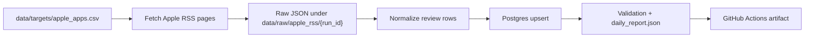

# App Store Review Pipeline

Apple App Store public-review ingestion pipeline for mainstream app-review analytics.

The pipeline uses Apple's public iTunes customer reviews RSS JSON feed, stores cumulative review data in Postgres, and keeps each daily run incremental by stopping when already-known review IDs appear in the recent-review window.

## Boundaries

- Apple App Store only.
- Public iTunes customer reviews RSS only.
- No login, cookies, CAPTCHA solving, proxy rotation, hidden endpoints, or App Store Connect credentials.
- No routine CSV export; Postgres is the cumulative store.
- The RSS feed is a recent-review source, not a guaranteed all-history source.
- HTML App Store pages are used only for source-health diagnostics, not as the main ingestion path. See [docs/source_notes.md](docs/source_notes.md).

## Architecture



Daily automation checks each active `app_id` and country in `data/targets/apple_apps.csv`. The current seed list contains 200 US App Store apps: the original benchmark set plus Apple US top free, top grossing, and top paid chart entries.

For each app-country scope it requests pages `1..10` from:

```text
https://itunes.apple.com/{country}/rss/customerreviews/page={page}/id={app_id}/sortby=mostrecent/json
```

The default 10-page cap reflects the observed Apple RSS limit of about 500 recent reviews per app-country scope. On incremental runs, the fetcher stops earlier when a page contains review IDs that are already in Postgres.

Apple's legacy RSS can return sparse pages: an empty `feed.entry` page may still include a `next` link, and later pages may contain review rows. For that reason, empty pages with `next` links are skipped through by default until the page cap or `--max-consecutive-empty-pages` is reached.

## Install

```bash
python3 -m venv .venv
.venv/bin/python -m pip install -r requirements.txt
```

## Local Postgres

Create a local database once:

```bash
createdb app_store_reviews
```

Initialize or migrate the schema:

```bash
.venv/bin/python app_store_pipeline.py init-postgres \
  --database-url postgresql:///app_store_reviews
```

## Commands

Summarize targets:

```bash
.venv/bin/python app_store_pipeline.py targets
```

Fetch raw RSS pages only:

```bash
.venv/bin/python app_store_pipeline.py fetch \
  --max-pages-per-app-country 2 \
  --request-delay-seconds 0.5
```

Run the full daily pipeline:

```bash
.venv/bin/python app_store_pipeline.py daily \
  --database-url postgresql:///app_store_reviews \
  --max-pages-per-app-country 10 \
  --max-consecutive-empty-pages 10 \
  --request-delay-seconds 1
```

Validate the cumulative database:

```bash
.venv/bin/python app_store_pipeline.py validate \
  --database-url postgresql:///app_store_reviews
```

Run tests:

```bash
.venv/bin/python -m pytest -q
git diff --check
```

## Data Model

The main Postgres tables are:

- `app_store_targets`: active app metadata from the target list.
- `app_store_runs`: one row per pipeline run.
- `app_store_review_pages`: one row per fetched RSS page.
- `app_store_reviews`: cumulative deduplicated reviews keyed by Apple RSS review ID plus app/country/source.
- `app_store_review_changes`: inserted or updated review audit log.
- `app_store_sync_state`: app-country incremental state and backlog warnings.

## Incremental Logic

The pipeline stores every review by a deterministic key:

```text
apple_app_store:apple_itunes_customerreviews_rss:{country}:{app_id}:{review_id}
```

On the next run it loads known review IDs for each app-country scope. Because the feed is sorted by recent reviews, once a fetched page overlaps known IDs, later pages should be older, so the run stops for that scope.

If the pipeline reaches page 10 without overlap, the scope is marked `backlogged`. That means the source window may be moving faster than the current schedule can cover, and the fix is to run more frequently or split countries/apps more carefully.

## GitHub Actions

Two workflows are included:

- `CI`: runs unit tests on GitHub-hosted Ubuntu.
- `App Store Review Pipeline`: runs the real daily ingestion on a self-hosted macOS ARM64 runner so it can reach the local Postgres database on this Mac.

The daily workflow defaults to:

- schedule: every 6 hours
- database: `postgresql:///app_store_reviews`
- secret override: `APP_STORE_DATABASE_URL`
- max pages per app-country: `10`
- max consecutive empty RSS pages with `next` links: `10`
- overlap stop: enabled

Before relying on automation, register a self-hosted runner for this GitHub repository and make sure local Postgres is running.
