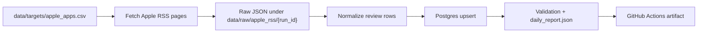

# App Store Review Pipeline

Apple App Store public-review ingestion pipeline for mainstream app-review analytics.

The pipeline uses Apple's public iTunes customer reviews RSS JSON feed, stores cumulative review data in Postgres, and keeps each daily run incremental by stopping when already-known review IDs appear in the recent-review window.

## Boundaries

- Apple App Store only.
- Public iTunes customer reviews RSS only.
- No login, cookies, CAPTCHA solving, proxy rotation, hidden endpoints, or App Store Connect credentials.
- No routine CSV export; Postgres is the cumulative store.
- The RSS feed is a recent-review source, not a guaranteed all-history source.
- HTML App Store pages are used only for source-health diagnostics, not as the main ingestion path. See [docs/source_notes.md](docs/source_notes.md).
- Replacement-source evaluation is tracked in [docs/source_replacement_options.md](docs/source_replacement_options.md).

## Architecture



Daily automation checks each active `app_id` and country in `data/targets/apple_apps.csv`. The current seed list contains 200 US App Store apps: the original benchmark set plus Apple US top free, top grossing, and top paid chart entries.

For each app-country scope it requests pages `1..10` from:

```text
https://itunes.apple.com/{country}/rss/customerreviews/page={page}/id={app_id}/sortby=mostrecent/json
```

The default 10-page cap reflects the observed Apple RSS limit of about 500 recent reviews per app-country scope. On incremental runs, the fetcher stops earlier when a page contains review IDs that are already in Postgres.

Apple's legacy RSS can return sparse pages: an empty `feed.entry` page may still include a `next` link, and later pages may contain review rows. For that reason, empty pages with `next` links are skipped through by default until the page cap or `--max-consecutive-empty-pages` is reached.

## Install

```bash
python3 -m venv .venv
.venv/bin/python -m pip install -r requirements.txt
```

## Local Postgres

Create a local database once:

```bash
createdb app_store_reviews
```

Initialize or migrate the schema:

```bash
.venv/bin/python app_store_pipeline.py init-postgres \
  --database-url postgresql:///app_store_reviews
```

## Commands

Summarize targets:

```bash
.venv/bin/python app_store_pipeline.py targets
```

Fetch raw RSS pages only:

```bash
.venv/bin/python app_store_pipeline.py fetch \
  --max-pages-per-app-country 2 \
  --request-delay-seconds 0.5
```

Run the full daily pipeline:

```bash
.venv/bin/python app_store_pipeline.py daily \
  --database-url postgresql:///app_store_reviews \
  --max-pages-per-app-country 10 \
  --max-consecutive-empty-pages 10 \
  --request-delay-seconds 1
```

Validate the cumulative database:

```bash
.venv/bin/python app_store_pipeline.py validate \
  --database-url postgresql:///app_store_reviews
```

Probe public App Store HTML and web JSON review surfaces:

```bash
.venv/bin/python app_store_pipeline.py probe-web \
  --limit 20 \
  --web-sort recent \
  --attempt-pagination \
  --max-web-pages 2 \
  --request-delay-seconds 1 \
  --web-429-retries 1 \
  --web-429-retry-seconds 30
```

`probe-web` is a source-health and feasibility diagnostic. It records visible HTML review cards, aggregate rating metadata, the public web catalog reviews endpoint with `sort=recent`, and optional next-page review counts. It does not load Postgres and is not the production ingestion source.

Compare RSS and web catalog on the same target window:

```bash
.venv/bin/python app_store_pipeline.py compare-sources \
  --limit 20 \
  --web-max-pages 5 \
  --web-review-limit 20 \
  --web-request-delay-seconds 2 \
  --web-429-retries 3 \
  --web-429-retry-seconds 45 \
  --rss-request-delay-seconds 0.5
```

`compare-sources` writes `source_comparison_report.json` with RSS volume, web catalog volume, 429 recovery counts, capacity/parity metrics, a same-order stability gate, and the stricter RSS-replacement gate.

Probe rendered App Store HTML with Playwright:

```bash
npm install
npx playwright install chromium
npm run probe:rendered-html -- \
  --url "https://apps.apple.com/us/app/amazon-shopping/id297606951?see-all=reviews&platform=iphone" \
  --output data/reports/rendered_html/amazon-shopping.json \
  --scrolls 8 \
  --wait-ms 1000
```

The Playwright probe records visible rendered review card IDs before and after scrolling, plus any review-related network requests triggered by the page. It is a diagnostic for HTML depth and stability, not a production ingestion path.

Probe the licensed 42matters candidate when an access token is available:

```bash
APP_STORE_42MATTERS_TOKEN=... \
.venv/bin/python app_store_pipeline.py probe-42matters \
  --limit 10 \
  --days 30 \
  --page-limit 5 \
  --request-limit 100 \
  --request-delay-seconds 0.4
```

`probe-42matters` is a provider feasibility probe only. It does not load Postgres, and it redacts the API token from saved report URLs.

Compare RSS and 42matters on the same target window:

```bash
APP_STORE_42MATTERS_TOKEN=... \
.venv/bin/python app_store_pipeline.py compare-42matters \
  --limit 10 \
  --provider-days 30 \
  --provider-page-limit 5 \
  --provider-request-limit 100 \
  --provider-request-delay-seconds 0.4 \
  --rss-request-delay-seconds 0.5
```

`compare-42matters` writes `provider_comparison_report.json` with RSS volume, provider volume, provider page success rate, per-app ratios, and candidate gates for same-order stability and RSS replacement.

Probe the licensed AppTweak candidate when an API token is available:

```bash
APP_STORE_APPTWEAK_TOKEN=... \
.venv/bin/python app_store_pipeline.py probe-apptweak \
  --limit 10 \
  --page-limit 2 \
  --request-limit 500 \
  --request-delay-seconds 1
```

Compare RSS and AppTweak on the same target window:

```bash
APP_STORE_APPTWEAK_TOKEN=... \
.venv/bin/python app_store_pipeline.py compare-apptweak \
  --limit 10 \
  --provider-page-limit 2 \
  --provider-request-limit 500 \
  --provider-request-delay-seconds 1 \
  --rss-request-delay-seconds 0.5
```

`compare-apptweak` writes the same `provider_comparison_report.json` shape as `compare-42matters`, so the two licensed providers can be judged against RSS using the same gates.

Run tests:

```bash
.venv/bin/python -m pytest -q
git diff --check
```

## Data Model

The main Postgres tables are:

- `app_store_targets`: active app metadata from the target list.
- `app_store_runs`: one row per pipeline run.
- `app_store_review_pages`: one row per fetched RSS page.
- `app_store_reviews`: cumulative deduplicated reviews keyed by Apple RSS review ID plus app/country/source.
- `app_store_review_changes`: inserted or updated review audit log.
- `app_store_sync_state`: app-country incremental state and backlog warnings.

## Incremental Logic

The pipeline stores every review by a deterministic key:

```text
apple_app_store:apple_itunes_customerreviews_rss:{country}:{app_id}:{review_id}
```

On the next run it loads known review IDs for each app-country scope. Because the feed is sorted by recent reviews, once a fetched page overlaps known IDs, later pages should be older, so the run stops for that scope.

If the pipeline reaches page 10 without overlap, the scope is marked `backlogged`. That means the source window may be moving faster than the current schedule can cover, and the fix is to run more frequently or split countries/apps more carefully.

## GitHub Actions

Five workflows are included:

- `CI`: runs unit tests on GitHub-hosted Ubuntu.
- `App Store Review Pipeline`: runs the real daily ingestion on a self-hosted macOS ARM64 runner so it can reach the local Postgres database on this Mac.
- `App Store Web Catalog Canary`: runs a bounded RSS vs web catalog `sort=recent` comparison on GitHub-hosted Ubuntu. It does not write Postgres and is used only to compare candidate source stability and review volume against RSS.
- `App Store Provider Compare`: manual-only RSS vs 42matters comparison on GitHub-hosted Ubuntu. It requires an `APP_STORE_42MATTERS_TOKEN` repository secret and does not write Postgres.
- `App Store AppTweak Compare`: manual-only RSS vs AppTweak comparison on GitHub-hosted Ubuntu. It requires an `APP_STORE_APPTWEAK_TOKEN` repository secret and does not write Postgres.

The daily workflow defaults to:

- schedule: every 6 hours
- database: `postgresql:///app_store_reviews`
- secret override: `APP_STORE_DATABASE_URL`
- max pages per app-country: `10`
- max consecutive empty RSS pages with `next` links: `10`
- overlap stop: enabled

Before relying on automation, register a self-hosted runner for this GitHub repository and make sure local Postgres is running.

The web catalog canary defaults to:

- schedule: every 6 hours, offset 30 minutes from the RSS workflow
- runner: GitHub-hosted Ubuntu
- target limit: `20`
- web catalog pages per app-country: `5`
- web catalog reviews per page: `20`
- sort: `recent`
- web catalog request delay: `2` seconds
- HTTP 429 retries: `3`
- HTTP 429 retry delay: `45` seconds
- RSS pages per app-country: `10`

Its artifact contains `data/reports/source_compare/{run_id}/source_comparison_report.json`, plus the raw RSS comparison files under `data/raw/source_compare/{run_id}/rss/`. Compare several runs before promoting web catalog reviews into the production ingestion path. The canary is intentionally a capacity-and-stability comparison, not a tiny liveness probe: RSS can return up to 50 reviews on one page while web catalog currently accepts `limit=20` per page, so web catalog must prove it can add enough value at predictable runtime. Use manual runs with higher `max_web_pages` only for deeper stress tests. The comparison section includes `web_configured_review_ceiling`, `web_pages_per_scope_needed_for_rss_parity`, `web_volume_gap_likely_configuration_limited`, and `web_unrecovered_429_page_count` to show whether a lower web count is caused by the configured page cap or deep-pagination instability.
