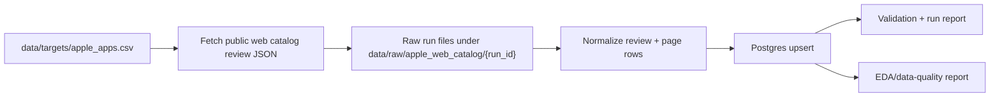

# App Store Review Pipeline

Apple App Store public-review ingestion pipeline for mainstream app-review analytics.

The production path uses Apple's public App Store web catalog review JSON, normalizes full written review rows, and stores cumulative data in local Postgres. The repository is intentionally focused on Apple App Store reviews only; no login, cookies, CAPTCHA solving, proxy rotation, hidden endpoint bypassing, App Store Connect credentials, or routine CSV export are used.

## Current State

- Primary source: `apple_app_store_web_catalog_reviews`
- Store: local Postgres database `app_store_reviews`
- Current target file: `data/targets/apple_apps.csv`
- Current target shape: `app_name`, `category`, `apple_app_id`, `apple_slug`, `countries`, `active`, `notes`
- Current target mode: all 200 tracked apps are active for full-scope daily incremental testing.
- Historical backfill is manually disabled. Routine collection uses twice-daily incremental ingestion.

## Architecture



Postgres is the source of truth. Raw JSON and GitHub artifacts are useful for audit/debugging, but the cumulative dataset lives in these tables:

- `app_store_targets`
- `app_store_executions`
- `app_store_runs`
- `app_store_run_scopes`
- `app_store_review_pages`
- `app_store_reviews`
- `app_store_review_changes`
- `app_store_sync_state`
- `app_store_monitor_snapshots`
- `app_store_pressure_state`
- `app_store_schema_migrations`

Review identity is `platform + source + country + app_id + review_id`, so repeated runs upsert existing reviews instead of duplicating them. If Apple returns changed review metadata, the row is updated and the change is recorded.

See `docs/storage_schema.md` for the storage-layer design, table relationships, primary keys, deduplication logic, lineage fields, and intentionally excluded source fields. See `docs/daily_incremental.md` for the current twice-daily incremental operating mode, and `docs/operating_limits.md` for the controlled operating-model evidence.

## Install

```bash
python3 -m venv .venv
.venv/bin/python -m pip install -r requirements.lock
```

Create and initialize local Postgres once:

```bash
createdb app_store_reviews
.venv/bin/python app_store_pipeline.py init-postgres \
  --database-url postgresql:///app_store_reviews
```

## Production Commands

Summarize target coverage:

```bash
.venv/bin/python app_store_pipeline.py targets
```

Fetch and load a full-scope daily incremental window:

```bash
.venv/bin/python app_store_pipeline.py daily-web-catalog \
  --database-url postgresql:///app_store_reviews \
  --limit 0 \
  --target-offset 0 \
  --max-pages-per-app-country 0 \
  --start-page 1 \
  --review-limit 20 \
  --request-delay-seconds 10 \
  --request-delay-jitter-seconds 5 \
  --web-429-retries 2 \
  --web-429-retry-seconds 300 \
  --web-429-retry-jitter-seconds 60 \
  --web-time-budget-seconds 3600 \
  --web-scope-time-budget-seconds 3600
```

Historical backfill is not a routine production command. After explicit operator approval, a single-scope capped diagnostic can use:

```bash
.venv/bin/python app_store_pipeline.py daily-web-catalog \
  --database-url postgresql:///app_store_reviews \
  --limit 1 \
  --target-offset 0 \
  --start-page 1 \
  --max-pages-per-app-country 25 \
  --review-limit 20 \
  --request-delay-seconds 10 \
  --web-time-budget-seconds 1200 \
  --web-scope-time-budget-seconds 1200 \
  --disable-overlap-stop
```

The GitHub backfill workflow remains disabled and additionally requires `I_UNDERSTAND_BACKFILL_PRESSURE`, one runner, an explicit numeric start page, 1-5 apps, and 1-25 pages per scope if an operator deliberately re-enables it. Automatic continuation is removed. A complete historical scope requires `no_next_href`; all guarded/capped results remain lower bounds.

Validate the database:

```bash
.venv/bin/python app_store_pipeline.py validate \
  --database-url postgresql:///app_store_reviews
```

Generate the reproducible EDA/data-quality report:

```bash
.venv/bin/python app_store_pipeline.py eda-report \
  --database-url postgresql:///app_store_reviews \
  --markdown-output docs/eda/apple_review_data_quality.md \
  --json-output docs/eda/apple_review_data_quality_summary.json \
  --html-output docs/eda/apple_review_data_quality_dashboard.html
```

Generate the reproducible operating-limits report:

```bash
.venv/bin/python app_store_pipeline.py operating-report \
  --database-url postgresql:///app_store_reviews \
  --ledger docs/experiments/operating_model_run_ledger.json \
  --markdown-output docs/operating_limits.md \
  --json-output docs/operating_limits_summary.json
```

## GitHub Actions

Active workflows:

- `CI`: test suite.
- `App Store Review Pipeline`: scheduled and dispatchable app-level matrix daily incremental profile. It runs at 08:07 and 20:07 America/Los_Angeles during PDT. Routine runs start each app at page 1 and fetch until trusted overlap, no-next, a time budget, or a fetch stop. Explicit safety-overlapped checkpoint recovery is available for a recent long-tail incremental backlog. Exact-execution monitoring and failing-only email are integrated.
- `App Store Alert Email Test`: manual SMTP/eligibility validation without ingestion.
- `App Store Web Catalog Backfill`: manually disabled and guarded; not part of routine operations.

Research-era workflows have been moved to `docs/archive/workflows/` so they remain auditable but no longer appear as active runnable Actions.

## Reports And Docs

- GitHub Pages review package: https://xvvvvx-bot.github.io/app-store-review-pipeline/
- Daily incremental operations: `docs/daily_incremental.md`
- Operating-limits report: `docs/operating_limits.md`
- Operating-limits summary JSON: `docs/operating_limits_summary.json`
- Operating-model run ledger: `docs/experiments/operating_model_run_ledger.json`
- Operating-model experiment runbook: `docs/experiments/operating_model_runbook.md`
- Data-quality report: `docs/eda/apple_review_data_quality.md`
- Data-quality summary JSON: `docs/eda/apple_review_data_quality_summary.json`
- Data-quality HTML dashboard: `docs/eda/apple_review_data_quality_dashboard.html`
- Architecture notes: `docs/architecture.md`
- Storage schema design: `docs/storage_schema.md`
- Monitoring and email alerts: `docs/monitoring.md`
- Operations and recovery runbook: `docs/operations_recovery.md`
- Source decision notes: `docs/source_decision_notes.md`
- Research archive: `docs/archive/`

## Known Limitations

- The public web catalog path is public Apple-hosted structured catalog data, not a contractual App Store Connect API.
- Historical completeness is proven per app-country scope only when the crawler reaches `no_next_href`.
- Incremental catch-up is proven when a daily run reaches trusted historical review overlap. This avoids stopping on reviews inserted by an earlier incomplete daily run.
- Deep historical backfill can trigger Apple pressure signals and is disabled by default. Daily ingestion records both final HTTP status and recovered 429 attempts, with a 5-minute per-request retry delay plus jitter and a current-run circuit breaker. Recovered attempts warn as degraded; failing 429 thresholds use final unrecovered pages.
- Local Postgres is the current development store. Managed Postgres can be evaluated later if the project moves toward production hosting.
