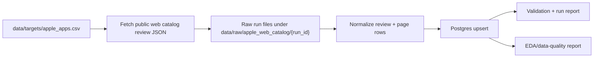

# App Store Review Pipeline

Apple App Store public-review ingestion pipeline for mainstream app-review analytics.

The production path uses Apple's public App Store web catalog review JSON, normalizes full written review rows, and stores cumulative data in local Postgres. The repository is intentionally focused on Apple App Store reviews only; no login, cookies, CAPTCHA solving, proxy rotation, hidden endpoint bypassing, App Store Connect credentials, or routine CSV export are used.

## Current State

- Primary source: `apple_app_store_web_catalog_reviews`
- Store: local Postgres database `app_store_reviews`
- Current target file: `data/targets/apple_apps.csv`
- Current target shape: `app_name`, `category`, `apple_app_id`, `apple_slug`, `countries`, `active`, `notes`
- Scheduled ingestion is paused while data quality and safe backfill strategy are being evaluated.
- Manual backfill is available, but further scaling should wait until the EDA findings are reviewed.

## Architecture



Postgres is the source of truth. Raw JSON and GitHub artifacts are useful for audit/debugging, but the cumulative dataset lives in these tables:

- `app_store_targets`
- `app_store_runs`
- `app_store_review_pages`
- `app_store_reviews`
- `app_store_review_changes`
- `app_store_sync_state`
- `app_store_pressure_state`

Review identity is `platform + source + country + app_id + review_id`, so repeated runs upsert existing reviews instead of duplicating them. If Apple returns changed review metadata, the row is updated and the change is recorded.

## Install

```bash
python3 -m venv .venv
.venv/bin/python -m pip install -r requirements.txt
```

Create and initialize local Postgres once:

```bash
createdb app_store_reviews
.venv/bin/python app_store_pipeline.py init-postgres \
  --database-url postgresql:///app_store_reviews
```

## Production Commands

Summarize target coverage:

```bash
.venv/bin/python app_store_pipeline.py targets
```

Fetch and load a conservative web-catalog window:

```bash
.venv/bin/python app_store_pipeline.py daily-web-catalog \
  --database-url postgresql:///app_store_reviews \
  --limit 1 \
  --target-offset 0 \
  --max-pages-per-app-country 5 \
  --review-limit 20 \
  --request-delay-seconds 10
```

Run a controlled backfill continuation for selected active targets:

```bash
.venv/bin/python app_store_pipeline.py daily-web-catalog \
  --database-url postgresql:///app_store_reviews \
  --limit 1 \
  --target-offset 0 \
  --start-page 1 \
  --max-pages-per-app-country 0 \
  --review-limit 20 \
  --request-delay-seconds 10 \
  --web-time-budget-seconds 1200 \
  --web-scope-time-budget-seconds 1200 \
  --disable-overlap-stop
```

A complete historical scope requires terminal evidence of `no_next_href`. Stops caused by page cap, overlap, time budget, final non-200 status, or fetch error are lower-bound results and should be continued or interpreted as incomplete.

Validate the database:

```bash
.venv/bin/python app_store_pipeline.py validate \
  --database-url postgresql:///app_store_reviews
```

Generate the reproducible EDA/data-quality report:

```bash
.venv/bin/python app_store_pipeline.py eda-report \
  --database-url postgresql:///app_store_reviews \
  --markdown-output docs/eda/apple_review_data_quality.md \
  --json-output docs/eda/apple_review_data_quality_summary.json
```

## GitHub Actions

Active workflows:

- `CI`: test suite.
- `App Store Review Pipeline`: dispatch-only daily profile; schedule remains paused.
- `App Store Web Catalog Backfill`: manual matrix backfill using self-hosted Mac runners and local Postgres.

Research-era workflows have been moved to `docs/archive/workflows/` so they remain auditable but no longer appear as active runnable Actions.

## Reports And Docs

- Data-quality report: `docs/eda/apple_review_data_quality.md`
- Data-quality summary JSON: `docs/eda/apple_review_data_quality_summary.json`
- Architecture notes: `docs/architecture.md`
- Source decision notes: `docs/source_decision_notes.md`
- Research archive: `docs/archive/`

## Known Limitations

- The public web catalog path is public Apple-hosted structured catalog data, not a contractual App Store Connect API.
- Completeness is proven per app-country scope only when the crawler reaches `no_next_href`.
- Deep historical backfill can trigger Apple pressure signals; HTTP 429 cooldown and circuit-breaker checks must stay enabled for manual backfill.
- Local Postgres is the current development store. Managed Postgres can be evaluated later if the project moves toward production hosting.
