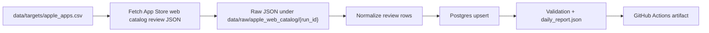
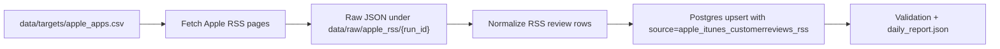

# App Store Review Pipeline

Apple App Store public-review ingestion pipeline for mainstream app-review analytics.

The scheduled pipeline now uses Apple's public App Store web catalog reviews JSON path, stores cumulative review data in Postgres, and keeps each daily run incremental by stopping when already-known web catalog review IDs appear after the current coverage target is met.

The legacy Apple public iTunes customer reviews RSS JSON feed remains available as a manual baseline and diagnostic source. It is useful for comparing recent-review windows, but it is no longer the scheduled primary ingestion path.

## Boundaries

- Apple App Store only.
- Scheduled primary ingestion uses public App Store web catalog review JSON.
- Legacy RSS ingestion is manual-only and used as a recent-window baseline.
- No login, cookies, CAPTCHA solving, proxy rotation, hidden endpoints, or App Store Connect credentials.
- No routine CSV export; Postgres is the cumulative store.
- Web catalog backfill is judged by terminal evidence. A run that stops on `no_next_href` has exhausted the observed catalog pagination for that app-country scope; a run that stops on page cap, parity target, overlap, error, or time budget is only a lower-bound depth result.
- HTML App Store pages are used only for source-health diagnostics, not as the main ingestion path. See [docs/source_notes.md](docs/source_notes.md).
- Replacement-source evaluation is tracked in [docs/source_replacement_options.md](docs/source_replacement_options.md).

## Architecture



The legacy RSS path follows the same storage shape when run manually:



Daily automation checks each active `app_id` and country in `data/targets/apple_apps.csv`. The current seed list contains 200 US App Store apps: the original benchmark set plus Apple US top free, top grossing, and top paid chart entries.

For each app-country scope the primary pipeline requests web catalog review pages from Apple's public catalog JSON path. The client preserves `sort=recent` and `limit=20` while following Apple's returned `next` href.

Manual complete-backfill probes set `--max-pages-per-app-country 0`, which means follow `next` links until one of these happens:

- Apple stops returning a next link: `no_next_href`, the strongest observed completion signal.
- A fetch error or final non-200 response occurs.
- The configured wall-clock budget is exhausted.
- Incremental overlap or RSS-parity stopping is enabled and the run has reached its intended daily target.

Legacy RSS requests pages `1..10` from:

```text
https://itunes.apple.com/{country}/rss/customerreviews/page={page}/id={app_id}/sortby=mostrecent/json
```

The default 10-page cap reflects the observed Apple RSS limit of about 500 recent reviews per app-country scope. On incremental runs, the fetcher stops earlier when a page contains review IDs that are already in Postgres.

Apple's legacy RSS can return sparse pages: an empty `feed.entry` page may still include a `next` link, and later pages may contain review rows. For that reason, empty pages with `next` links are skipped through by default until the page cap or `--max-consecutive-empty-pages` is reached.

## Install

```bash
python3 -m venv .venv
.venv/bin/python -m pip install -r requirements.txt
```

## Local Postgres

Create a local database once:

```bash
createdb app_store_reviews
```

Initialize or migrate the schema:

```bash
.venv/bin/python app_store_pipeline.py init-postgres \
  --database-url postgresql:///app_store_reviews
```

## Commands

Summarize targets:

```bash
.venv/bin/python app_store_pipeline.py targets
```

Fetch raw RSS pages only:

```bash
.venv/bin/python app_store_pipeline.py fetch \
  --max-pages-per-app-country 2 \
  --request-delay-seconds 0.5
```

Run the manual legacy RSS pipeline locally:

```bash
.venv/bin/python app_store_pipeline.py daily \
  --database-url postgresql:///app_store_reviews \
  --max-pages-per-app-country 10 \
  --max-consecutive-empty-pages 10 \
  --request-delay-seconds 1
```

Fetch public web catalog review rows only:

```bash
.venv/bin/python app_store_pipeline.py fetch-web-catalog \
  --limit 1 \
  --target-offset 10 \
  --max-pages-per-app-country 25 \
  --review-limit 20 \
  --request-delay-seconds 5 \
  --web-429-retries 5 \
  --web-429-retry-seconds 60 \
  --web-429-backoff-multiplier 1.5
```

Run the primary web catalog ingestion path into Postgres:

```bash
.venv/bin/python app_store_pipeline.py daily-web-catalog \
  --database-url postgresql:///app_store_reviews \
  --limit 1 \
  --target-offset 10 \
  --max-pages-per-app-country 35 \
  --review-limit 20 \
  --request-delay-seconds 5 \
  --web-429-retries 5 \
  --web-429-retry-seconds 60 \
  --web-429-backoff-multiplier 1.5 \
  --stop-at-rss-parity
```

Keep this path conservative: one app per run is the profile that has passed the current public-source gate. Larger web catalog batches are stress tests, not the routine default.

For manual complete-backfill probes, set `--max-pages-per-app-country 0` and disable overlap stopping. A successful complete probe must stop with `no_next_href`; otherwise the result is a lower-bound depth measurement:

```bash
.venv/bin/python app_store_pipeline.py daily-web-catalog \
  --database-url postgresql:///app_store_reviews \
  --limit 1 \
  --target-offset 0 \
  --max-pages-per-app-country 0 \
  --review-limit 20 \
  --request-delay-seconds 5 \
  --web-429-retries 5 \
  --web-429-retry-seconds 60 \
  --web-429-backoff-multiplier 1.5 \
  --web-time-budget-seconds 1800 \
  --disable-overlap-stop
```

For manual depth-limit probes, use `--start-page` to continue beyond an earlier window without re-fetching earlier pages:

```bash
.venv/bin/python app_store_pipeline.py daily-web-catalog \
  --database-url postgresql:///app_store_reviews \
  --limit 1 \
  --target-offset 0 \
  --start-page 51 \
  --max-pages-per-app-country 100 \
  --review-limit 20 \
  --request-delay-seconds 5 \
  --web-time-budget-seconds 1800 \
  --disable-overlap-stop
```

Apple currently caps each web catalog review page at `20` rows. The known depth lower bound from live testing is above 5,000 reviews for Amazon Shopping; that run stopped at our configured page cap while the response still advertised a next page, not at an Apple no-next or final non-200 response. Deeper offsets showed more retry pressure, so keep depth probes controlled and documented rather than making very deep pagination routine.

Validate the cumulative database:

```bash
.venv/bin/python app_store_pipeline.py validate \
  --database-url postgresql:///app_store_reviews
```

Summarize downloaded web catalog ingestion artifacts:

```bash
.venv/bin/python scripts/summarize_web_catalog_ingestion.py \
  --root /path/to/downloaded/artifacts \
  --database-url postgresql:///app_store_reviews \
  --output-json data/reports/web_catalog_ingestion_history.json \
  --output-markdown data/reports/web_catalog_ingestion_history.md
```

Use `--full-single-app-only` when judging the routine single-app profile; leave it off when analyzing manual depth-limit probes.
When `--database-url` is provided, the summary also includes a web catalog depth section from Postgres page/review tables. Use it to distinguish an observed lower bound, such as a run stopping at RSS parity or page cap while the terminal page still had `next`, from a true catalog-exhaustion limit.

Summarize cumulative RSS vs web catalog coverage directly from Postgres:

```bash
.venv/bin/python scripts/summarize_source_coverage.py \
  --database-url postgresql:///app_store_reviews \
  --output-json data/reports/source_coverage_scorecard.json \
  --output-markdown data/reports/source_coverage_scorecard.md \
  --min-parity-scopes 20
```

Use this scorecard to track whether web catalog coverage is broad enough to replace RSS. It reports web catalog app-country scopes at or above RSS, scopes still below RSS, missing web catalog scopes, and aggregate web/RSS ratios.

Probe public App Store HTML and web JSON review surfaces:

```bash
.venv/bin/python app_store_pipeline.py probe-web \
  --limit 20 \
  --web-sort recent \
  --attempt-pagination \
  --max-web-pages 2 \
  --review-limit 20 \
  --request-delay-seconds 1 \
  --web-429-retries 1 \
  --web-429-retry-seconds 30 \
  --skip-html
```

`probe-web` is a source-health and feasibility diagnostic. By default it can record visible HTML review cards, aggregate rating metadata, the public web catalog reviews endpoint with `sort=recent`, and optional next-page review counts. Use `--skip-html` when the question is web catalog stability or volume; this avoids the extra HTML page request and tests only the structured JSON review path. It does not load Postgres and is not the production ingestion source.

Compare RSS and web catalog on the same target window:

```bash
.venv/bin/python app_store_pipeline.py compare-sources \
  --limit 20 \
  --web-max-pages 5 \
  --web-review-limit 20 \
  --web-request-delay-seconds 2 \
  --web-429-retries 3 \
  --web-429-retry-seconds 45 \
  --web-429-backoff-multiplier 1 \
  --web-skip-html \
  --web-stop-at-rss-parity \
  --rss-request-delay-seconds 0.5
```

`compare-sources` writes `source_comparison_report.json` and the human-readable `source_comparison_report.md` with RSS volume, web catalog volume, 429 recovery counts, capacity/parity metrics, a same-order stability gate, the stricter RSS-replacement gate, and `source_decision.status`. Use `--web-skip-html` for canary and replacement-source testing so the result measures the JSON review endpoint without an extra HTML request. Use `--web-stop-at-rss-parity` for deeper tests so each app-country web crawl stops once it has matched that scope's RSS review count, reducing unnecessary deep-pagination requests. The web catalog retry path honors `Retry-After` when Apple provides it; otherwise it uses `--web-429-retry-seconds` with the optional `--web-429-backoff-multiplier` for conservative depth tests.

Probe rendered App Store HTML with Playwright:

```bash
npm install
npx playwright install chromium
npm run probe:rendered-html -- \
  --url "https://apps.apple.com/us/app/amazon-shopping/id297606951?see-all=reviews&platform=iphone" \
  --output data/reports/rendered_html/amazon-shopping.json \
  --scrolls 8 \
  --wait-ms 1000
```

The Playwright probe records visible rendered review card IDs before and after scrolling, plus any review-related network requests triggered by the page. It is a diagnostic for HTML depth and stability, not a production ingestion path.

Probe the licensed 42matters candidate when an access token is available:

```bash
APP_STORE_42MATTERS_TOKEN=... \
.venv/bin/python app_store_pipeline.py probe-42matters \
  --limit 10 \
  --days 30 \
  --page-limit 5 \
  --request-limit 100 \
  --request-delay-seconds 0.4
```

`probe-42matters` is a provider feasibility probe only. It does not load Postgres, and it redacts the API token from saved report URLs.

Compare RSS and 42matters on the same target window:

```bash
APP_STORE_42MATTERS_TOKEN=... \
.venv/bin/python app_store_pipeline.py compare-42matters \
  --limit 10 \
  --provider-days 30 \
  --provider-page-limit 5 \
  --provider-request-limit 100 \
  --provider-request-delay-seconds 0.4 \
  --rss-request-delay-seconds 0.5
```

`compare-42matters` writes `provider_comparison_report.json` with RSS volume, provider volume, provider page success rate, per-app ratios, configured fetch ceiling, reported provider inventory, and candidate gates for same-order stability and RSS replacement. If provider volume is below RSS, check `provider_volume_gap_likely_configuration_limited`, `provider_reported_total_reviews`, and `provider_additional_pages_per_row_needed_for_rss_parity` before deciding the provider itself is too shallow.

Probe the licensed AppTweak candidate when an API token is available:

```bash
APP_STORE_APPTWEAK_TOKEN=... \
.venv/bin/python app_store_pipeline.py probe-apptweak \
  --limit 10 \
  --page-limit 2 \
  --request-limit 500 \
  --request-delay-seconds 1
```

Compare RSS and AppTweak on the same target window:

```bash
APP_STORE_APPTWEAK_TOKEN=... \
.venv/bin/python app_store_pipeline.py compare-apptweak \
  --limit 10 \
  --provider-page-limit 2 \
  --provider-request-limit 500 \
  --provider-request-delay-seconds 1 \
  --rss-request-delay-seconds 0.5
```

`compare-apptweak` writes the same `provider_comparison_report.json` shape as `compare-42matters`, so the two licensed providers can be judged against RSS using the same gates and capacity diagnostics.

Probe the licensed Appfigures Public Data candidate when a personal access token is available:

```bash
APP_STORE_APPFIGURES_TOKEN=... \
.venv/bin/python app_store_pipeline.py probe-appfigures \
  --limit 10 \
  --page-limit 2 \
  --request-limit 500 \
  --request-delay-seconds 1
```

Compare RSS and Appfigures on the same target window:

```bash
APP_STORE_APPFIGURES_TOKEN=... \
.venv/bin/python app_store_pipeline.py compare-appfigures \
  --limit 10 \
  --provider-page-limit 2 \
  --provider-request-limit 500 \
  --provider-request-delay-seconds 1 \
  --rss-request-delay-seconds 0.5
```

`compare-appfigures` first maps Apple IDs to Appfigures product IDs with `/products/apple/{id}`, then fetches `/reviews`. It writes the same provider comparison shape as the other licensed-provider probes.

Run every configured licensed-provider POC in one pass:

```bash
.venv/bin/python scripts/run_provider_matrix.py \
  --limit 10 \
  --provider-page-limit 2 \
  --provider-42matters-request-limit 100 \
  --provider-large-request-limit 500 \
  --rss-request-delay-seconds 0.5
```

The matrix runner detects `APP_STORE_42MATTERS_TOKEN`, `APP_STORE_APPTWEAK_TOKEN`, and `APP_STORE_APPFIGURES_TOKEN`. Missing-token providers are recorded as `missing_secret`; configured providers are run and summarized in `data/reports/provider_matrix/provider_matrix_summary.json` plus the human-readable `data/reports/provider_matrix/provider_matrix_report.md`. The summary includes `source_decision.status`, which is one of `needs_provider_secret`, `configured_provider_runs_failed`, `needs_deeper_provider_run`, `same_order_but_not_replacement`, `replacement_candidate_found`, or `no_provider_met_gate`.

Run tests:

```bash
.venv/bin/python -m pytest -q
git diff --check
```

## Data Model

The main Postgres tables are:

- `app_store_targets`: active app metadata from the target list.
- `app_store_runs`: one row per pipeline run.
- `app_store_review_pages`: one row per fetched RSS page.
- `app_store_reviews`: cumulative deduplicated reviews keyed by Apple RSS review ID plus app/country/source.
- `app_store_review_changes`: inserted or updated review audit log.
- `app_store_sync_state`: app-country incremental state and backlog warnings.

## Incremental Logic

The pipeline stores every review by a deterministic key:

```text
apple_app_store:apple_app_store_web_catalog_reviews:{country}:{app_id}:{review_id}
```

On the next run it loads known web catalog review IDs for each app-country scope. Because the web catalog path is requested with `sort=recent`, once a fetched page overlaps known IDs after the intended coverage target is met, later pages should be older, so the run stops for that scope.

If a manual backfill run uses `--max-pages-per-app-country 0`, page cap is disabled and the fetcher follows Apple's `next` links until `no_next_href`, a non-200/error, the wall-clock budget, or a configured stop rule. Only `no_next_href` is evidence that the observed web catalog pagination has been exhausted for that app-country scope.

## GitHub Actions

Ten workflows are included:

- `CI`: runs unit tests on GitHub-hosted Ubuntu.
- `App Store Review Pipeline`: runs the primary scheduled web catalog ingestion on a self-hosted macOS ARM64 runner so it can reach the local Postgres database on this Mac.
- `Legacy App Store RSS Pipeline`: manual-only RSS ingestion for baseline checks and historical comparison.
- `App Store Web Catalog Canary`: runs a bounded RSS vs web catalog `sort=recent` comparison on GitHub-hosted Ubuntu. It does not write Postgres and is used only to compare candidate source stability and review volume against RSS.
- `App Store Web Catalog Ingestion`: manual-only web catalog ingestion for controlled probes that should not change the scheduled workflow.
- `App Store Web Catalog Backfill`: manual-only complete-backfill probe. The default `max_pages_per_app_country=0` follows web catalog `next` links until terminal evidence, error, or budget.
- `App Store Provider Compare`: manual-only RSS vs 42matters comparison on GitHub-hosted Ubuntu. It requires an `APP_STORE_42MATTERS_TOKEN` repository secret and does not write Postgres.
- `App Store AppTweak Compare`: manual-only RSS vs AppTweak comparison on GitHub-hosted Ubuntu. It requires an `APP_STORE_APPTWEAK_TOKEN` repository secret and does not write Postgres.
- `App Store Appfigures Compare`: manual-only RSS vs Appfigures Public Data comparison on GitHub-hosted Ubuntu. It requires an `APP_STORE_APPFIGURES_TOKEN` repository secret and does not write Postgres.
- `App Store Provider Matrix Compare`: manual-only one-shot runner for every configured licensed provider secret. It uploads a provider matrix summary even when no provider secrets are configured.

The daily workflow defaults to:

- schedule: every 6 hours
- source: web catalog reviews JSON
- database: `postgresql:///app_store_reviews`
- secret override: `APP_STORE_DATABASE_URL`
- target limit: `1`
- target offset: `auto`, selected from Postgres coverage gaps
- web catalog pages per app-country: `35`
- start page: `1`
- web catalog reviews per page: `20`
- web catalog request delay: `5` seconds
- HTTP 429 retries: `5`
- HTTP 429 retry delay: `60` seconds
- HTTP 429 backoff multiplier: `1.5`
- web time budget: `1200` seconds
- overlap stop: enabled
- RSS-parity stopping during migration: enabled by default

Before relying on automation, register a self-hosted runner for this GitHub repository and make sure local Postgres is running.

The web catalog canary defaults to:

- schedule: every 6 hours, offset 30 minutes from the RSS workflow
- runner: GitHub-hosted Ubuntu
- target limit: `1`
- target offset: `auto`
- web catalog pages per app-country: `25`
- start page: `1`
- web catalog reviews per page: `20`
- sort: `recent`
- web catalog request delay: `5` seconds
- HTTP 429 retries: `5`
- HTTP 429 retry delay: `60` seconds
- HTTP 429 backoff multiplier: `1.5`
- web time budget: `1200` seconds
- HTML page probe: skipped by default
- stop after each app-country matches its RSS review count: enabled by default
- RSS pages per app-country: `10`

Its artifact contains `data/reports/source_compare/{run_id}/source_comparison_report.json`, the readable `source_comparison_report.md`, plus the raw RSS comparison files under `data/raw/source_compare/{run_id}/rss/`. Compare several runs before promoting web catalog reviews into the production ingestion path. The canary is intentionally a capacity-and-stability comparison, not a tiny liveness probe: RSS can return up to 50 reviews on one page while web catalog currently accepts `limit=20` per page, so web catalog must prove it can add enough value at predictable runtime. Use manual runs with higher `max_web_pages` only for deeper stress tests; keep RSS-parity stopping enabled unless you are deliberately stress-testing post-parity pagination. The comparison section includes `web_configured_review_ceiling`, `web_pages_per_scope_needed_for_rss_parity`, `web_volume_gap_likely_configuration_limited`, `web_unrecovered_429_page_count`, `web_catalog_target_reached_scopes`, and `web_catalog_stop_reasons` to show whether a lower web count is caused by the configured page cap, successful parity stopping, or deep-pagination instability. Read `source_decision.status` first: `web_catalog_replacement_candidate` is the only public-web result that can justify repeated promotion testing; `rss_baseline_empty`, `needs_deeper_web_catalog_run`, `same_order_but_not_replacement`, and `web_catalog_unstable_after_retry` are not production replacement outcomes.

The web catalog ingestion workflow defaults to:

- schedule: manual-only
- runner: self-hosted macOS ARM64
- database: `postgresql:///app_store_reviews`
- secret override: `APP_STORE_DATABASE_URL`
- target limit: `1`
- target offset: `auto`, selected from Postgres coverage gaps instead of simple time rotation
- web catalog pages per app-country: `35`
- web catalog reviews per page: `20`
- web catalog request delay: `5` seconds
- HTTP 429 retries: `5`
- HTTP 429 retry delay: `60` seconds
- HTTP 429 backoff multiplier: `1.5`
- overlap stop: enabled
- stop after each app-country matches its current RSS review count: enabled by default

This workflow is a manual control surface for the same web catalog source used by the primary daily workflow. It stores web catalog rows with a separate source key, so analysts can compare legacy RSS and web catalog coverage in the same Postgres database without overwriting rows. The scheduled profile uses RSS-parity stopping during migration so high-volume apps can go beyond the old 25-page / 500-review ceiling when needed, while still stopping early once web catalog has matched the RSS-sized current window. When `target_offset=auto`, the workflow asks the source coverage scorecard for the highest-priority app-country scope below RSS parity, preferring scopes that can reach parity within the configured page cap.

The web catalog backfill workflow defaults to:

- schedule: manual-only
- runner: self-hosted macOS ARM64
- matrix target limit: `1`
- matrix target offset: `0`
- max parallel app jobs: `2`
- start page: `auto`, meaning continue from the highest stored page plus one, and skip apps that already reached `no_next_href`
- web catalog pages per app-country: `0`, meaning no page cap
- web catalog reviews per page: `20`
- web catalog request delay: `5` seconds
- HTTP 429 retries: `5`
- HTTP 429 retry delay: `60` seconds
- HTTP 429 backoff multiplier: `1.5`
- per app job web time budget: `1800` seconds
- per app-country scope web time budget: `1800` seconds
- overlap stop: disabled

Use the backfill workflow to test whether one or many app-country scopes can be exhausted. The workflow builds a GitHub Actions matrix from `data/targets/apple_apps.csv`; each matrix job runs exactly one app (`--limit 1`) and writes a separate artifact named with that app's target offset and app ID. `fail-fast` is disabled, so one app's throttling, failure, or timeout does not cancel the remaining app jobs. The overall workflow can still fail if any app job fails, which is useful because failures should remain visible.

For a 200-app sweep, dispatch `App Store Web Catalog Backfill` with:

- `target_offset`: `0`
- `limit`: `200`
- `max_pages_per_app_country`: `0`
- `start_page`: `auto`
- `max_parallel`: start with `2`
- `web_time_budget_seconds`: start with `1800`
- `web_scope_time_budget_seconds`: start with `1800`

True parallelism requires multiple self-hosted runner instances. With only one runner process on the Mac, matrix jobs queue one at a time even though the workflow is matrix-ready. If you add more local runner instances, install each one in a separate runner directory so concurrent jobs do not share a working folder.

If the final page report stops on `no_next_href`, the run found the observed end of Apple's web catalog pagination for that scope. If it stops on `scope_time_budget_exceeded`, `time_budget_exceeded`, `page_cap`, `non_200_page`, or `fetch_error`, treat the row count as a lower bound and continue later with `start_page`.

The web catalog `daily_report.json` includes stability fields in `fetch_summary`, including `status_code_counts`, `attempt_counts`, `retried_pages`, `final_non_200_pages`, `missing_text`, `missing_rating`, and `all_pages_ok_after_retry`. For source decisions, read these fields together with `reviews`, `unique_reviews`, and the Postgres row counts by `source`.
The ingestion history summary adds cumulative depth evidence such as max page reached, apps at or above 500 unique web catalog reviews, final non-200 pages, and whether the terminal page still had a `next` link.

Manual workflow dispatch includes `start_page` for depth probes. Routine scheduled runs should keep `start_page=1`; use values above 1 only for controlled limit tests after preserving artifact evidence.

A conservative manual deep profile for replacement-source testing is:

- `limit`: `10`
- `max_web_pages`: `25`
- `web_review_limit`: `20`
- `request_delay_seconds`: `2`
- `web_429_retries`: `5`
- `web_429_retry_seconds`: `20`
- `web_429_backoff_multiplier`: `1.5`
- `web_stop_at_rss_parity`: `true`
