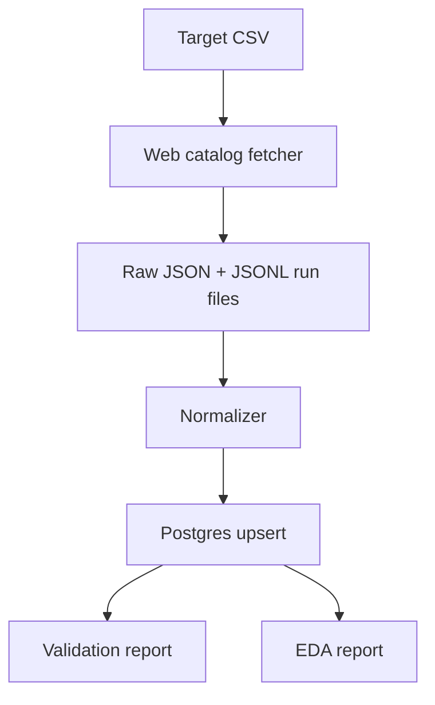

# Architecture Notes

## Source

The production source is Apple's public App Store web catalog review JSON path, stored as:

```text
apple_app_store_web_catalog_reviews
```

The source returns structured public review rows, including observed review ID, author name, rating, title, full review text, updated timestamp, app identity, and country storefront.

This project does not use App Store Connect credentials because the target use case is public third-party app-review monitoring rather than owned-app review management.

## Data Flow



Targets live at `data/targets/apple_apps.csv`. Each active `app_id + country` pair is a scope.

The fetcher requests web catalog review pages with `sort=recent` and `limit=20`, follows Apple's returned `next` href, and records page-level metadata such as status code, attempts, response bytes, review counts, `has_next_link`, terminal reason, and missing-field counts.

## Storage

Postgres is the cumulative store:

- `app_store_targets`: app metadata and active flag.
- `app_store_runs`: run-level load metrics.
- `app_store_review_pages`: one row per fetched page.
- `app_store_reviews`: one row per unique review key.
- `app_store_review_changes`: inserted/updated review audit rows.
- `app_store_sync_state`: app-country incremental state.
- `app_store_pressure_state`: safe/candidate pressure settings and cooldown state.

Review identity is:

```text
platform + source + country + app_id + review_id
```

Repeated runs therefore update existing reviews rather than duplicating them.

The detailed storage-layer design is documented in `docs/storage_schema.md`, including table relationships, primary keys, review deduplication, run/page lineage, data-quality fields, EDA/modeling fields, and excluded source fields.

## Completeness Semantics

Daily incremental completeness and historical backfill completeness are intentionally separate:

- Daily incremental runs can stop after they reach their configured recent coverage target and encounter already-known review IDs.
- Historical backfill runs are complete only when the observed terminal reason is `no_next_href`.

Weaker stop reasons include `page_cap`, `caught_up_to_existing_reviews`, `time_budget_exceeded`, `scope_time_budget_exceeded`, `non_200_page`, and `fetch_error`. These are useful operational signals, but they are lower-bound evidence rather than proof that Apple has no more review pages.

## Operations

GitHub Actions uses self-hosted Mac runners because local Postgres is the development store. The active workflows are CI, dispatch-only daily ingestion, and manual web-catalog backfill. Scheduled ingestion is currently paused while data quality and safe long-run behavior are evaluated.

The backfill workflow uses:

- local Postgres initialization before every job
- global writer concurrency through GitHub Actions
- HTTP 429 cooldown and current-run circuit breaker checks
- per-app time budgets
- retry tracking and page-level status recording

## Reporting

The reproducible EDA report is generated from Postgres:

```bash
.venv/bin/python app_store_pipeline.py eda-report \
  --database-url postgresql:///app_store_reviews
```

The report writes `docs/eda/apple_review_data_quality.md` and `docs/eda/apple_review_data_quality_summary.json`.
It also writes the self-contained visual dashboard at `docs/eda/apple_review_data_quality_dashboard.html`.

Historical source probes, provider comparisons, legacy RSS notes, and rendered-HTML experiments are preserved under `docs/archive/` but are not part of the active production path.
