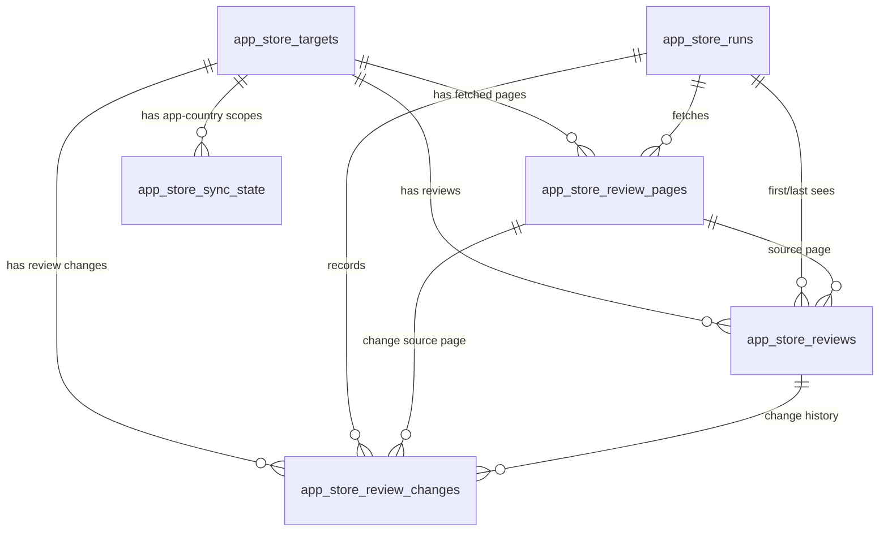

# Storage Schema

This document defines the reusable storage layer for the Apple App Store review pipeline. The goal is to keep the schema traceable, extensible, and useful for downstream EDA and modeling without adding lookup tables before they are needed.

The current physical schema is created in `app_store_review_pipeline/postgres_database.py` by `POSTGRES_SCHEMA`. Local Postgres is the source of truth for cumulative review data.

## Design Goals

- Preserve review lineage from target app, source, run, and fetched page.
- Upsert repeated observations instead of duplicating reviews.
- Record whether a review was first inserted or later updated.
- Keep page-level fetch health visible for retry, cooldown, and completeness decisions.
- Store enough review, timestamp, rating, and text fields for EDA and modeling.
- Exclude fields that the public web catalog source does not provide reliably.

## Tables

### `app_store_targets`

App-level metadata and the active target list.

Primary key:

- `app_id`

Important fields:

- `app_name`: display name used in reports.
- `category`: analyst-facing category from the target list.
- `apple_slug`: App Store URL slug.
- `countries`: storefront countries included for the target. Current production scope is `us`.
- `active`: integer flag used by runs to select targets.
- `notes`: operational notes, such as temporary rotation status.
- `first_seen_run_id`, `last_seen_run_id`: when the target definition entered or was last synced into Postgres.

Design note: category metadata is intentionally stored directly on the target row for now. A separate `categories` dimension can be added later if category definitions become governed metadata.

### `app_store_runs`

One row per loaded ingestion run.

Primary key:

- `run_id`

Important fields:

- `raw_dir`: local raw artifact directory for the run.
- `targets_path`: target CSV used by the run.
- `loaded_at`: load timestamp.
- `platform`: currently `apple_app_store`.
- `source`: currently `apple_app_store_web_catalog_reviews`.
- `target_count`, `page_count`, `review_count`: run-level volume.
- `reviews_inserted`, `reviews_updated`, `duplicates_skipped`: load outcome.
- `fetch_errors`, `capped_scopes`: operational health and completeness signals.

This table answers: which run produced or touched the data, how much it loaded, and whether the run had operational problems.

### `app_store_review_pages`

One row per fetched web-catalog page.

Primary key:

- `page_key`

Unique key:

- `(run_id, app_id, country, sort_by, page_number)`

Foreign keys:

- `run_id` to `app_store_runs`
- `app_id` to `app_store_targets`

Important fields:

- `platform`, `source`, `app_id`, `app_name`, `country`, `sort_by`, `page_number`: page identity.
- `request_url`: exact source URL requested.
- `status`, `status_code`: fetch status and HTTP code.
- `fetched_at`: fetch timestamp.
- `raw_json_path`: local raw JSON path for audit/debugging.
- `response_bytes`: response size.
- `review_count`, `unique_review_count`, `duplicate_count`: page-level content counts.
- `missing_text_count`, `missing_rating_count`, `missing_updated_count`: page-level data-quality flags.
- `max_updated_epoch_seconds`, `min_updated_epoch_seconds`: timestamp range on the page.
- `has_next_link`: whether Apple returned a next-page link.
- `attempt_count`: retry count for this page.
- `error_message`: fetch or parse error details.
- `terminal_reason`: why a scope stopped, for example `no_next_href`, `page_cap`, `fetch_error`, `sparse_fetch_error_threshold`, or time-budget stops.
- `overlap_review_count`: known-review overlap observed on the page.

This table is the operational audit layer. It lets us distinguish source exhaustion from throttling, page cap, retry behavior, empty pages, and data-quality issues.

### `app_store_reviews`

One row per deduplicated review observation.

Primary key:

- `review_key`

Unique key:

- `(platform, source, country, app_id, review_id)`

Foreign keys:

- `app_id` to `app_store_targets`
- `first_seen_run_id` to `app_store_runs`
- `last_seen_run_id` to `app_store_runs`
- `source_page_key` to `app_store_review_pages`

Important fields:

- `review_key`: deterministic dedupe key.
- `platform`, `source`, `country`, `app_id`, `review_id`: source identity.
- `app_name`: denormalized app name for convenient analysis snapshots.
- `author_name`: public reviewer display name from the source.
- `updated_at`, `updated_epoch_seconds`: review timestamp.
- `rating`: 1 to 5 star rating where provided.
- `title`: review title.
- `content`: full written review text.
- `first_seen_run_id`: run that first inserted the review.
- `last_seen_run_id`: most recent run that observed or updated the review.
- `source_page_key`: page that produced the current stored version.
- `collected_at`: pipeline collection timestamp.
- `created_at`, `row_updated_at`: storage timestamps.

This table is the primary analytical fact table for EDA and modeling.

### `app_store_review_changes`

Audit table for inserted and updated reviews.

Primary key:

- `change_id`

Unique key:

- `(run_id, review_key)`

Foreign keys:

- `run_id` to `app_store_runs`
- `review_key` to `app_store_reviews`
- `app_id` to `app_store_targets`
- `source_page_key` to `app_store_review_pages`

Important fields:

- `change_type`: `inserted` or `updated`.
- `previous_updated_epoch_seconds`: prior timestamp when a known review changed.
- `new_updated_epoch_seconds`: current timestamp.
- `changed_at`: storage timestamp for the change event.

This table answers: did a run create a new review row, or did it observe a changed existing review?

### `app_store_sync_state`

Incremental/backfill state per app-country-sort scope.

Primary key:

- `scope_key`

Foreign key:

- `app_id` to `app_store_targets`

Important fields:

- `app_id`, `country`, `sort_by`: scope identity.
- `complete_through_updated_epoch_seconds`: timestamp watermark.
- `backlogged`: whether the scope still needs deeper historical coverage.
- `last_started_at`, `last_completed_at`: most recent run timing.
- `last_run_id`, `last_successful_run_id`: run lineage.
- `last_terminal_reason`: latest stop reason for this scope.
- `last_page_count`, `last_review_count`, `last_overlap_review_count`: latest run outcome.
- `updated_at`: state update timestamp.

This table is used to resume work and to distinguish incremental refresh from historical backfill.

### `app_store_pressure_state`

Operational tuning state for backfill pressure tests.

Primary key:

- `source`

Important fields:

- safe, candidate, and next values for page caps, parallelism, and scope time budgets.
- cooldown and confirmed 429 counters.
- latest run outcome and page/error metrics.

This table is operational metadata, not core review data. It can be ignored by most EDA and modeling queries.

## Deduplication Logic

The canonical review identity is:

```text
platform + source + country + app_id + review_id
```

The stored `review_key` follows the same identity:

```text
apple_app_store:{source}:{country}:{app_id}:{review_id}
```

For the current production source, `review_id` is provided by Apple's public web catalog payload. Repeated runs therefore update the same `app_store_reviews` row instead of adding duplicates. The table also enforces the same identity with a unique constraint on `(platform, source, country, app_id, review_id)`.

When a known review is seen again:

- `last_seen_run_id` is updated.
- `source_page_key` points to the most recent producing page.
- if review metadata changed, `app_store_review_changes` records an `updated` event.

If a future source lacks stable review IDs, the design can support a deterministic fallback hash, but that is not active for the Apple web catalog path because stable review IDs are currently available.

## Source And Category Metadata

The schema intentionally keeps source and category metadata lightweight:

- `source` is stored as text on runs, pages, and reviews.
- `category` is stored as text on targets.

This avoids premature lookup tables while preserving enough information for filtering, grouping, and lineage. If additional sources become production sources later, a `review_sources` dimension can be added without changing the review identity pattern.

## Data Quality And Modeling Fields

The review table supports downstream analysis through:

- `rating`: rating distributions and supervised labels.
- `title`, `content`: NLP, sentiment, topic modeling, complaint extraction, and low-signal filtering.
- `updated_epoch_seconds`: recency, trend, cohort, and freshness analysis.
- `app_id`, `app_name`, `category`, `country`: segmentation.
- `first_seen_run_id`, `last_seen_run_id`, `source_page_key`: lineage and repeatability.

The page table supports pipeline-quality and source-quality analysis through:

- `status_code`, `attempt_count`, `error_message`: reliability and retry behavior.
- `terminal_reason`: completeness interpretation.
- `missing_text_count`, `missing_rating_count`, `missing_updated_count`: field-level quality checks.
- `review_count`, `unique_review_count`, `duplicate_count`, `overlap_review_count`: duplication, coverage, and incremental progress.
- `min_updated_epoch_seconds`, `max_updated_epoch_seconds`: page-level timestamp windows.

The run table supports operational EDA through:

- volume by run
- inserted versus updated rows
- duplicate and fetch-error counts
- capped or incomplete scopes

## Completeness Semantics

Completeness is scope-specific. A scope is:

```text
app_id + country + sort_by + source
```

Historical completeness is strongest when the last page has terminal reason `no_next_href`. Other stop reasons, including page cap, time budget, fetch error, final non-200, overlap stops, or sparse fetch errors, should be interpreted as lower-bound evidence rather than proof that no more historical pages exist.

Daily incremental completeness is different: a daily run may stop after finding sufficient recent coverage or known review overlap, even though historical backfill is incomplete.

## Intentionally Excluded Fields

The public web catalog source currently does not reliably provide these App Store Connect or legacy RSS-style fields:

- app version
- vote sum
- vote count
- developer response metadata
- device metadata
- reviewer account identifiers beyond the public display name

The schema does not include `version`, `vote_sum`, or `vote_count`; migrations explicitly drop them if they exist from older experiments. These fields should not be reintroduced unless they appear in the production source payload with stable semantics.

## Extension Points

Likely future additions, if needed:

- `app_store_sources`: governed source metadata, terms, refresh cadence, and source reliability notes.
- `app_store_categories`: governed category definitions and rollups.
- `app_store_review_quality_flags`: row-level derived flags such as language, spam/low-signal score, HTML-like text, URL-like text, or normalized text hash.
- `app_store_review_embeddings`: optional model features or embeddings, stored separately from raw reviews.
- managed Postgres deployment settings if the project moves beyond local development.

These are intentionally deferred until the dataset and modeling use cases justify them.

## Appendix: Entity Relationship Diagram


