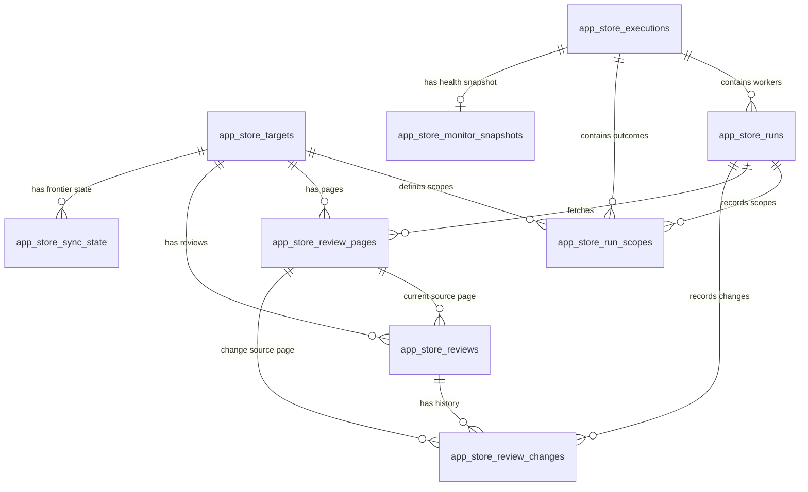

# Storage Schema

This document defines the reusable Postgres storage layer for Apple App Store review ingestion. Postgres is the cumulative source of truth; raw JSON and GitHub artifacts are supporting evidence.

Schema changes are versioned in `app_store_review_pipeline/migrations/`. `app_store_schema_migrations` stores the filename, SHA-256 checksum, and application time. Initialization takes a Postgres advisory lock, applies each migration once, and rejects a changed checksum for an already-applied migration.

## Design Goals

- Trace every review from GitHub execution to worker run, fetched page, and source scope.
- Preserve exact intended versus completed scope counts.
- Upsert stable review identities and audit inserted or changed values.
- Separate last attempted freshness from last successful catch-up freshness.
- Preserve source-pressure evidence, including recovered retries.
- Support EDA/modeling without inventing fields that Apple does not expose.

## Relationship Summary

The main lineage is:

```text
execution -> worker run -> scope outcome -> fetched pages -> reviews -> review changes
```

Targets define intended app-country scopes. Sync state holds the durable successful frontier. Monitor snapshots record health and database growth without changing review facts.

## Tables

### `app_store_targets`

One row per app. Primary key: `app_id`.

Key fields are app name, analyst category, Apple slug, countries, active flag, notes, and first/last target-sync run IDs. Category remains inline until governed category metadata justifies a dimension table.

### `app_store_executions`

One row per GitHub workflow run attempt or local execution. Primary key: `execution_id`.

It stores GitHub run/attempt/workflow/event/SHA lineage, source, scope/config signatures, intended target/scope counts, completed outcome counts, health status, and start/completion timestamps. This is the unit monitored by `monitoring-report`.

### `app_store_runs`

One row per worker load. Primary key: `run_id`; optional parent: `execution_id`.

It stores the worker key, GitHub lineage, source, paths, target/page/review volumes, inserts, updates, skipped duplicates, fetch errors, capped scopes, and both legacy `loaded_at` text plus typed `loaded_at_ts`.

### `app_store_run_scopes`

One row per run/source/app/country/sort scope. Primary key: `scope_run_key`.

It records exact page/review/load counts, final 429 pages, all 429 attempts, soft retries, other non-200 pages, retried pages, fetch errors, overlap rows, terminal reason, and one explicit outcome:

- `caught_up`: trusted overlap or another successful terminal reason;
- `backlogged`: incomplete but recoverable, such as page/time budget;
- `hard_failure`: zero pages, fetch/parse failure, or final source error.

Execution counts are refreshed from these persisted outcomes. A missing intended scope is therefore detectable instead of disappearing into an aggregate.

### `app_store_review_pages`

One row per fetched page. Primary key: `page_key`; unique `(run_id, app_id, country, sort_by, page_number)`.

Lineage fields identify run, source, app, country, sort, page number, exact request URL, raw JSON path, and typed/text fetch time. Operational fields include final status/code, response bytes, review/quality counts, timestamp bounds, next-link state, attempts, all 429 attempts, soft retries, error message, terminal reason, and known-review overlap.

`status_code` is the final response. `http_429_attempt_count` preserves recovered 429s that would otherwise look like a clean 200 page.

### `app_store_reviews`

The deduplicated analytical fact table. Primary key: `review_key`; unique `(platform, source, country, app_id, review_id)`.

It stores app/source identity, public author name, review timestamp, rating, title, content, first/last seen runs, current source page, collection timestamp, and row create/update timestamps. `collected_at_ts` is the typed query/index field; `collected_at` remains for backward compatibility.

### `app_store_review_changes`

Append-only insert/update audit. Primary key: `change_id`; unique `(run_id, review_key)`.

For each inserted or changed review it stores change type, old/new review epoch, source page, typed/text change time, `changed_fields`, and JSONB `previous_values`/`new_values`. An update is recorded only when one of the stored source fields actually changes.

### `app_store_sync_state`

Durable state per source/app/country/sort scope. Primary key: source-qualified `scope_key`.

It stores the watermark, latest attempt, latest successful catch-up run/time, last terminal reason/counts, backlog start, and consecutive incomplete-run count. Daily overlap stopping trusts `last_successful_run_id`; an incomplete attempt updates collection freshness but does not advance the successful catch-up frontier. Monitoring reports these as separate freshness and backlog signals.

### `app_store_monitor_snapshots`

One snapshot per monitored execution. Primary key: `snapshot_id`; unique non-null `execution_id`.

It stores health status, table row counts, total database bytes, the complete machine-readable metrics JSONB, and capture time. Snapshots support growth and comparable-run monitoring.

### `app_store_pressure_state`

Legacy operational state for controlled source-pressure experiments. It stores safe/candidate caps, parallelism, budgets, cooldown state, and recent pressure metrics. Routine daily incremental uses fixed documented settings; historical backfill is disabled by default.

### `app_store_schema_migrations`

Applied migration ledger. Primary key: migration filename/version. The checksum prevents silent mutation of already-applied schema history.

## Deduplication And Change Logic

The canonical identity is:

```text
platform + source + country + app_id + review_id
```

For the active source:

```text
apple_app_store:apple_app_store_web_catalog_reviews:{country}:{app_id}:{review_id}
```

Repeated observations update lineage/collection time without adding another review. A changed source value updates the fact row and writes one audit row containing the changed field names and before/after values. Inserts also write one change row. Monitoring reconciles run insert/update totals against this ledger.

## Timestamp Strategy

Older tables retain text timestamps for compatibility, while current writes dual-write typed `timestamptz` columns. Typed fields are used for monitoring windows and indexes:

- `app_store_runs.loaded_at_ts`
- `app_store_review_pages.fetched_at_ts`
- `app_store_reviews.collected_at_ts`
- `app_store_review_changes.changed_at_ts`
- `app_store_sync_state.last_started_at_ts`, `last_completed_at_ts`

`backfill-typed-timestamps` fills legacy rows in committed batches so a multi-million-row conversion does not require one long transaction.

## Completeness Semantics

A scope is `source + app_id + country + sort_by`.

Daily incremental catch-up is proven by trusted overlap, `no_next_href`, or another explicit success terminal reason. Page cap, time budget, retry-window limit, and similar stops are backlogged. Fetch errors, final source errors, sparse-fetch failure, and zero-page scopes are hard failures.

Historical exhaustion is stronger and is proven only by `no_next_href`. Deep backfill remains disabled until an operator explicitly confirms the guarded manual workflow.

## EDA And Modeling Fields

Reviews provide rating, title, content, author, review time, app/category/country, and lineage. Pages provide quality counts, timestamp ranges, overlap, terminal reason, retry/429 evidence, and exact source URL. Runs/executions/scopes provide volume, duplicate, freshness, pressure, and reliability features.

Derived language, spam, HTML-like, URL-like, normalized-text hash, embeddings, and model outputs should live in separate derived tables if production use requires them; they are not raw source fields.

## Intentionally Excluded Fields

The public Apple web catalog does not reliably provide App Store Connect owner-only fields such as app version, vote/helpfulness counts, developer-response metadata, device metadata, or private reviewer identifiers. They are intentionally absent and must not be synthesized as source facts.

## Appendix: Entity Relationship Diagram


